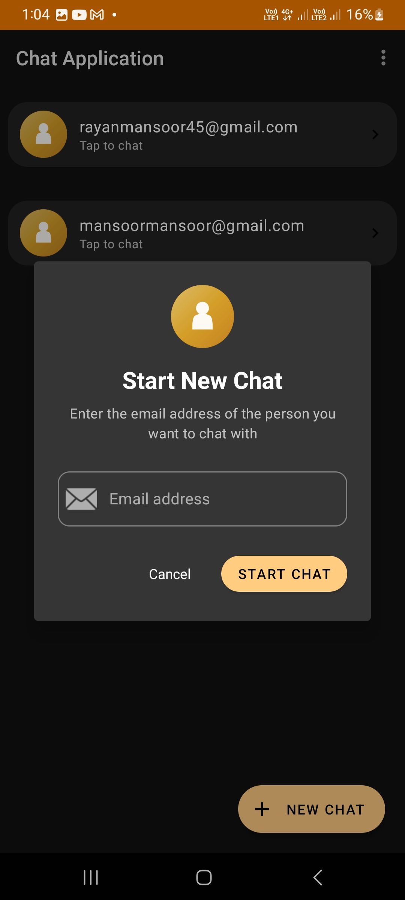
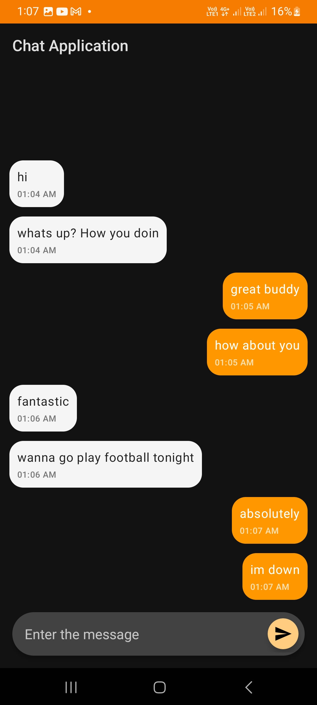

# Android Firebase Chat App (Kotlin + Firebase)

A clean, beginner‑friendly **1‑to‑1 chat app for Android** written in **Kotlin**, powered by **Firebase Authentication**, **Cloud Firestore** (for channels & user profiles), and **Firebase Realtime Database** (for live messages). The project is intentionally small but production‑leaning—great as a learning template or a starting point for your own chat apps.

<div align="center">

[](https://developer.android.com/)
[](https://firebase.google.com/)

</div>

---

## Demo Screenshots

| Home                                                             | Sign Up                                                                | Chat                                                             |
| ---------------------------------------------------------------- | ---------------------------------------------------------------------- | ---------------------------------------------------------------- |
|  |  |  |

---

## Features

* 🔐 **Firebase Authentication (Email/Password)**

  * Sign up & sign in with client-side validation and clear inline errors using `TextInputLayout`.
* ⚡ **Realtime messaging (Firebase Realtime Database)**

  * Low-latency stream under `/messages/{channelId}`; auto-scroll to latest; server-side timestamps for ordering.
* 🗂️ **Channels & profiles in Cloud Firestore**

  * Deterministic `channelId` from two UIDs; `members` array for access control; `updatedAt` for list sorting.
* ➕ **Add-by-email flow**

  * Looks up a `users` doc by `userEmail`, creates (or reuses) a channel idempotently with `SetOptions.merge()`.
* 🧭 **Polished Android UX**

  * ViewBinding, RecyclerView, Material components; IME actions (send on Go/Done), keyboard hide on submit, progress indicators.
* 🧱 **Centralized Firebase accessors**

  * `FirebaseRefs` singletons for Auth, RTDB, Firestore + typed paths (`messages`, `memberships`, `users`, `channels`).
* 🔐 **Safer-by-default rules**

  * Starter security rules restrict reads/writes to channel members via `/memberships`.
* 🧰 **Simple to fork**

  * Minimal dependencies; Kotlin; works on API 21+.

---

## How it Works

* **Users** sign up or sign in with email + password.
* To start a chat, use the **Add** button and enter the other user’s email. The app looks up that user in Firestore (`users` collection) and creates (or reuses) a **channel** doc in Firestore with a stable **channelId** derived from both UIDs.
* **Messages** are written under `RTDB /messages/{channelId}` for latency‑friendly live streaming.
* The channel’s `updatedAt` timestamp in Firestore is bumped on each send for easy sorting.
* Membership is asserted at `RTDB /memberships/{channelId}/{uid} = true`.

### Data Model

**Cloud Firestore**

```
/users/{uid} {
  userID: string  // == uid
  userEmail: string
}

/channels/{channelId} {
  members: string[]   // [uidA, uidB]
  kind: "dm"
  createdAt: Timestamp
  updatedAt: Timestamp
}
```

**Realtime Database**

```
/messages/{channelId}/{messageId} {
  senderID: string  // uid
  msgContent: string
  timestamp: number // epoch millis
}

/memberships/{channelId}/{uid}: true
```

**Channel ID** is stable and order‑independent:

```kotlin
fun getChannelId(a: String, b: String): String = if (a <= b) "${'$'}a_${'$'}b" else "${'$'}b_${'$'}a"
```

### Why Firestore **and** Realtime Database?

* **Firestore** is excellent for **documents you list & query**, like channels and user profiles (membership, timestamps, etc.).
* **Realtime Database** excels at **append‑only feeds** with low latency and high fan‑out—perfect for message streams.

This hybrid keeps the UI simple and snappy while keeping channel metadata queryable.

---

## Getting Started

### Prerequisites

* **Android Studio** (latest stable) with Kotlin support
* **Firebase project** with **Authentication**, **Cloud Firestore (Native mode)**, and **Realtime Database** enabled

### Firebase Setup

1. Create a Firebase project and add an **Android app** with package name `com.example.chatapplication` (or your own).
2. Download **`google-services.json`** and place it under `app/`.
3. In **Authentication → Sign‑in method**, enable **Email/Password**.
4. In **Firestore**, create the database (Native mode). In **Realtime Database**, create the database. Choose a region close to your users.
5. (Optional) Add 1–2 test users via the app or Firebase Console.

### Run the App

* Open the project in Android Studio, **Sync Gradle**, then **Run** on a device or emulator.

> If you rename the application id, update it in Firebase Console and re‑download `google-services.json`.

---

## Security Rules (Recommended starters)

> These are **starter** rules suitable for a small demo. Review and harden before production.

### Cloud Firestore rules

```javascript
rules_version = '2';
service cloud.firestore {
  match /databases/{database}/documents {

    // Only the owner can read/write their profile
    match /users/{uid} {
      allow read, create, update, delete: if request.auth != null && request.auth.uid == uid;
    }

    // Channels are readable/writable only by members
    match /channels/{channelId} {
      allow read: if request.auth != null && request.auth.uid in resource.data.members;
      allow create, update, delete: if request.auth != null && request.auth.uid in request.resource.data.members;
    }
  }
}
```

### Realtime Database rules

```json
{
  "rules": {
    "messages": {
      "$channelId": {
        ".read": "auth != null && root.child('memberships').child($channelId).child(auth.uid).val() == true",
        ".write": "auth != null && root.child('memberships').child($channelId).child(auth.uid).val() == true"
      }
    },
    "memberships": {
      "$channelId": {
        "$uid": {
          ".read": "auth != null && auth.uid == $uid",
          ".write": "auth != null && auth.uid == $uid"
        }
      }
    }
  }
}
```

> The app sets `memberships/{channelId}/{uid} = true` when a user opens a chat. This gate then authorizes message reads/writes for that channel.

---

## Configuration Notes

* **API keys & `google-services.json`**: The Android API key in `google-services.json` is not a secret, but you should still **restrict** it in the Google Cloud Console (Android app SHA‑1/256 + package, and HTTP referrers for web keys). It’s normal for `google-services.json` to change when you add new apps, regenerate keys, or migrate projects—always re‑download the latest.
* **Regions**: Prefer a single region for Firestore/RTDB close to your users to minimize latency.
* **Timestamps**: Firestore `createdAt`/`updatedAt` use `FieldValue.serverTimestamp()` to avoid device‑clock drift.

---

## Roadmap

* Message status (sent/delivered/read)
* Typing indicators & presence
* Image/file messages (Cloud Storage)
* Push notifications (FCM)
* Group chats
* Basic moderation / rate limiting

---

## Contributing

Contributions are welcome! Feel free to:

1. **Fork** the repo
2. Create a **feature** branch: `git checkout -b feat/your-idea`
3. **Commit**: `git commit -m "feat: add your idea"`
4. **Push**: `git push origin feat/your-idea`
5. Open a **Pull Request**

Please keep PRs focused and include screenshots/video for UI changes when possible.

---

## License

MIT License — see [LICENSE](LICENSE) for details.

---

**Author**: @your‑handle
**Questions?** Open an issue and describe the context, logs, and steps to reproduce. Happy building! 🚀
